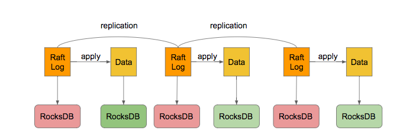

# 6.5840 Lab
官方网站：https://pdos.csail.mit.edu/6.824/labs/lab-raft.html
## Study Notes

mapreduce 结构 https://www.mubu.com/doc/2qvlcfblV6b

raft 实现总结 https://www.mubu.com/doc/2prW5zqFYmb

raft test总结 https://mubu.com/app/edit/home/2KNq7ixmm_r

raft 一致性总结 https://www.mubu.com/doc/1ZoHdMBk9Cb

raft 论文 https://pdos.csail.mit.edu/6.824/papers/raft-extended.pdf

参考资料 https://mit-public-courses-cn-translatio.gitbook.io/mit6-824/lecture-07-raft2/7.3-hui-fu-jia-su-backup-acceleration

## Lab2 Raft
1. 进入测试目录
```bash
cd .\6.5840\src\raft
```
2. 单次测试某一个部分
```bash
go test -run 2A
go test -run TestInitialElection2A
```
3. 测试全部
```bash
go test
```

4. 脚本批量测试
```bash
python3 dstest.py -n 100 -p 128 2A 2B 2C 2D # (linux)
python dstest.py -n 100 -p 128 2A 2B 2C 2D # (windows)
```

5.批量测试case
```bash
python dstest.py -n 100 -p 128 -e 2C
python dstest.py -n 100 -p 128 TestRPCBytes2B 
```


### raft部分框架图


### 同步步骤：


1.Propose：node将收到的SQL请求转化为Raft日志；

2.Append：Leader副本将Raft日志持久化到本地的RocksDB Raft中（RocksDB写）；

3.Replicate：Leader副本将Raft日志发送给其他节点上自己的Follower副本。Follower副本在收到Raft日志后，也要持久化到自己本地的RocksDB Raft中（Append）；

4.Committed：Follower副本在将收到的Raft日志持久化到自己的本地存储后，会向Leader副本返回一个确认信息。当超过半数的副本（包括Leader副本在内）都完成Append后，Raft日志同步的状态变为Committed；

5.Apply：Leader副本将Raft日志应用到本地的RocksDB KV中（RocksDB写）。（Apply步骤不保证Follower副本也已经将Raft日志应用到本地的RocksDB KV中）
